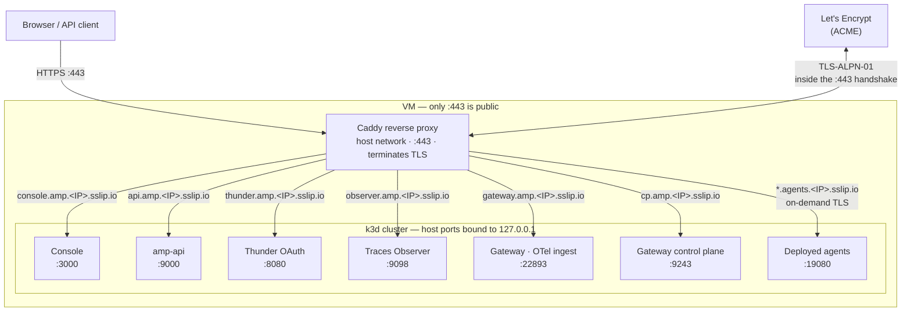

# Run Agent Manager on a VM with Docker

Install Agent Manager on a Linux VM where Docker is the only host dependency. You SSH into the VM and run a single installer there, and it exposes the platform over HTTPS using [sslip.io](https://sslip.io) hostnames derived from the VM's public IP, so there's no domain registration and no client `/etc/hosts` edits.

## Prerequisites

You only need an SSH client to log into the VM; everything else runs on the VM.
- A Linux VM with a **static (reserved) public IP** and SSH access (sudo). The install derives every hostname, TLS certificate, and OAuth issuer from the IP (`*.amp.<IP>.sslip.io`), so a **changing IP breaks the install** — and stopping the VM (for example to resize its disk) releases an ephemeral IP. Reserve the address before installing. If the IP ever changes, reinstall against the new IP.
- **At least 50 GB of disk.** Building and running agents pushes the in-cluster image store past 13 GB; on a smaller disk the node hits `DiskPressure`, which evicts pods and can take cluster DNS down mid-build.
- **At least 4 vCPUs and 8 GB of RAM** to run the full k3d + OpenChoreo + Agent Manager stack comfortably.
- **Inbound `443/tcp` open** in the cloud security group / firewall — and only 443. Certificates issue via the TLS-ALPN-01 ACME challenge, which runs inside the `:443` TLS handshake, so no inbound port 80 is ever needed. The `:443` exposure must be **TCP passthrough** (not a TLS-terminating load balancer in front), since the challenge happens inside the handshake.
- **Docker** is required — the whole stack runs on it (k3d runs the Kubernetes cluster as Docker containers, and Caddy runs as a container). If Docker isn't already installed, the script installs it for you, along with k3d, kubectl, helm, and lsof.

## Install

SSH into the VM, get the installer, and run it with `sudo`:

```bash
# on the VM
git clone https://github.com/wso2/agent-manager.git
cd agent-manager/deployments/quick-start/vm

sudo ./install-vm.sh \
  --host <VM_PUBLIC_IP> \
  --version <amp-release> \
  --email you@example.com
```

Pass `--host` the VM's **public** IPv4 address — a cloud VM usually can't read its own public IP (it's NAT'd behind the address you used to SSH in), so the installer needs it to build the `*.amp.<IP>.sslip.io` hostnames. Set `--version` to the Agent Manager release you want (an existing `amp/v*` [tag](https://github.com/wso2/agent-manager/tags), e.g. `0.15.0`).

The installer runs in two phases — bootstrap (Docker + tools + firewall) and the platform install + Caddy startup. Allow 8–15 minutes. It needs `sudo` because it installs Docker, opens the firewall, and creates the cluster.

### Options

| Flag | Default | Purpose |
|---|---|---|
| `--host` | _(required)_ | The VM's public IPv4 address |
| `--version` | _(required)_ | Agent Manager release to install (an `amp/v*` tag, e.g. `0.15.0`) |
| `--email` | _(none)_ | ACME contact for expiry notices |
| `--no-external-gateways` | off | Drop the gateway control-plane endpoint if you won't connect external gateways |

## What gets exposed

The installer fronts the stack with [Caddy](https://caddyserver.com), an open-source web server that terminates TLS, obtains and renews Let's Encrypt certificates automatically, and reverse-proxies each public hostname to the right service. It runs as a single `amp-caddy` Docker container and is the only process listening on the internet-facing ports.

Only `:443` faces the internet; all other service ports are bound to the VM's loopback and reached only by Caddy.



Every public hostname resolves to the VM's IP (via sslip.io) and arrives at Caddy on `:443`; Caddy terminates TLS and reverse-proxies to the matching loopback port. Certificates are obtained over that same `:443` using the TLS-ALPN-01 challenge, so no inbound port 80 is needed. The deployed-agent wildcard gets its certificate on demand at first request.

| URL | Purpose |
|---|---|
| `https://console.amp.<IP>.sslip.io` | Console UI |
| `https://api.amp.<IP>.sslip.io` | Agent Manager API (used by `amctl`) |
| `https://thunder.amp.<IP>.sslip.io` | Thunder OAuth (login) |
| `https://observer.amp.<IP>.sslip.io` | Traces Observer |
| `https://gateway.amp.<IP>.sslip.io/otel` | OTel trace ingest from deployed agents |
| `https://<org>-<project>.agents.<IP>.sslip.io/...` | Deployed-agent invocation endpoints (one wildcard host per org/project) |
| `https://cp.amp.<IP>.sslip.io` | Gateway control plane — connect external gateways here (on by default) |

## Log in

Open `https://console.amp.<IP>.sslip.io` and sign in as the seeded Agent Manager admin user **`amp-admin`** (password **`amp-admin`**). This user holds the AMP `admin` role, which grants every application permission.

From the `0.16.0` release, role-based access control is enforced on the API (`rbacEnabled`), so the token must carry the right scopes. Note that Thunder's own system account (`admin` / `admin`, shown in the bootstrap logs) is **not** granted the Agent Manager application role — signing in with it lets you reach the console but every API call fails with `403 insufficient permissions`. Always use `amp-admin`.

## Deployed-agent invocation

When you deploy an agent, its endpoint is published on a per-project host `<org>-<project>.agents.<IP>.sslip.io` and routed by Caddy to the OpenChoreo data-plane gateway. Because these hostnames are dynamic (a new one per org/project), Caddy issues their TLS certificates **on demand** at the first request (via the same ACME challenge as the fixed hosts), rather than up front. Invocations are authenticated with a user token that the gateway validates against the public Thunder issuer.

Because issuance is on demand and uses TLS-ALPN-01 (the challenge runs inside the `:443` handshake), the **very first request to a newly-deployed agent host can fail with a one-time certificate error** — most visibly `ERR_CERTIFICATE_TRANSPARENCY_REQUIRED` in Chrome. That first connection is consumed by Caddy answering the ACME challenge, so the browser briefly sees the challenge certificate instead of the real one. Issuance completes within a second or two; reload the page (or open it in a fresh tab) and it serves the trusted Let's Encrypt certificate. This only affects the first hit per new agent host — the certificate is then cached in the `amp-caddy-data` volume.

amp-api advertises each agent endpoint with the `https://` scheme (the installer sets `tlsEnabled` on the service), so the console — and any other caller — invokes it over TLS directly through the wildcard site.

## TLS

Caddy obtains and auto-renews trusted Let's Encrypt certificates on first start — no manual certificate steps. Issuance uses the **TLS-ALPN-01** challenge, which runs inside the `:443` TLS handshake, so only inbound 443 is ever required and there is no port-80 dependency. Certificates and the ACME account persist in the `amp-caddy-data` Docker volume, so restarts do not re-request them.

Because the challenge happens inside the TLS handshake, the public `:443` must reach Caddy as **raw TCP** — do not put a TLS-terminating load balancer in front of the VM. There is no `:80` listener, so plain `http://` URLs are not served (no automatic http→https redirect); always use the `https://` URLs the installer prints.

## Persistence and teardown

Application data (PostgreSQL), issued certificates, and the k3d cluster persist
across Docker/host restarts via named volumes. To tear down, use the existing
`uninstall.sh` in `deployments/quick-start/` and `docker rm -f amp-caddy`.

## Connect an external gateway

Agent Manager can drive external WSO2 AI gateways. The control-plane endpoint `https://cp.amp.<IP>.sslip.io` is exposed by default for this. In the console, open **Infrastructure → Gateways**, generate a registration token, and follow the generated commands — they point the gateway at `cp.amp.<IP>.sslip.io:443`, where it opens a control WebSocket and pulls its configuration. If you do not need external gateways, install with `--no-external-gateways` to drop this endpoint.

**Security:** the registration token grants a gateway your LLM-provider API keys and
proxy credentials. Treat it as a secret, revoke/regenerate it from the Gateways page
when a gateway is decommissioned, and optionally restrict `cp.amp...` to known
gateway source IPs at the firewall.

## Troubleshooting

- **Certificates never issue / hosts unreachable from outside** — open inbound `:443` in your cloud security group / NACL, and make sure the public `:443` reaches the VM as **raw TCP**: a TLS-terminating load balancer in front breaks the TLS-ALPN-01 challenge. The installer can't verify external reachability from inside the VM, so this surfaces as Caddy failing to obtain certificates (`docker logs amp-caddy`).
- **Certificate not issued** — check `docker logs amp-caddy`. Let's Encrypt rate limits on sslip.io are high but not infinite; if hit, retry shortly.
- **Login redirect mismatch** — confirm you reached the console via its `console.amp.<IP>.sslip.io` URL, not the raw IP.
- **`403 insufficient permissions` on API calls** — you are signed in as Thunder's system `admin` account, which has no Agent Manager application role. Sign out and sign back in as `amp-admin` (see [Log in](#log-in)).
- **Certificate error on first agent invocation** (`ERR_CERTIFICATE_TRANSPARENCY_REQUIRED` or similar) — the per-agent certificate is issued on demand, and the first request races with that issuance. Reload the page after a second or two; it only happens once per new agent host (see [Deployed-agent invocation](#deployed-agent-invocation)).
