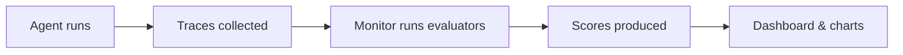

import Tabs from '@theme/Tabs';
import TabItem from '@theme/TabItem';

# Evaluation

WSO2 Agent Manager provides built-in evaluation capabilities to continuously assess AI agent quality. Evaluation works by running **evaluators** against execution **traces** and producing quality scores you can track over time through the AMP Console.

## Why Evaluate Agents?

Traditional software is deterministic: given the same input, you get the same output. Tests pass or fail consistently. AI agents break this assumption. The same prompt can produce:

- Different final answers (correct, partially correct, or wrong)
- Different tool call sequences (efficient or roundabout)
- Different reasoning paths (sound or flawed)
- Different error modes (graceful fallback or hallucinated response)

This non-determinism means you cannot test an agent once and trust it forever. A prompt that worked yesterday might fail tomorrow because the model's behavior shifted, a tool's API changed, or context retrieval returned different documents.

Continuous evaluation addresses this by enabling:

- **Regression detection**: catch quality drops before users notice
- **Production monitoring**: track quality trends across real traffic
- **Failure analysis**: identify which failure modes to fix next
- **Data-driven improvement**: measure the impact of changes over time

## Trace-Based Evaluation

Evaluation in AMP is built on **traces**, the detailed execution records that capture every step of an agent's work. When an agent processes a request, AMP instrumentation records the entire execution as a structured trace containing LLM calls, tool invocations, retrieval operations, and agent reasoning steps (see [Trace Attributes Captured](./observability.mdx#trace-attributes-captured)).

Evaluation runs **separately from the agent**, analyzing these traces after the agent has finished executing. This architecture provides several advantages:

- **Zero performance impact**: evaluation never slows down or interferes with the agent's runtime
- **Framework-agnostic**: any agent that produces OpenTelemetry traces can be evaluated, regardless of framework (LangChain, CrewAI, OpenAI Agents, or custom)
- **Retrospective analysis**: you can evaluate old traces with new evaluators without re-running the agent



## Evaluators

Evaluating an agent is not just about checking whether the final answer is correct. Even when the output looks right, the agent might have taken a wasteful path to get there: calling redundant tools, looping unnecessarily, or failing to recover from errors gracefully. A single agent interaction has multiple dimensions of quality:

- **Accuracy**: is the information factually correct?
- **Helpfulness**: does the response address what the user actually needed?
- **Safety**: did any step produce harmful or policy-violating content?
- **Tool usage**: did the agent use the right tools? Did it avoid unnecessary or redundant calls?
- **Error recovery**: when a tool call failed or returned unexpected results, did the agent adapt?
- **Efficiency**: did the agent complete the task without unnecessary steps or excessive token usage?
- **Reasoning**: were the agent's decisions logical and purposeful?
- **Tone**: was the communication appropriate and professional?

Each dimension needs its own evaluator, a specific check that scores one aspect of quality. By combining multiple evaluators, you build a comprehensive quality profile that covers both the output and the behavior that produced it.

AMP includes **24 built-in evaluators** across these dimensions (see [Built-in Evaluators](#built-in-evaluators) for the full reference). You can also [create custom evaluators](#custom-evaluators) for domain-specific quality checks. Built-in evaluators fall into two categories:

<Tabs>
  <TabItem value="rule-based" label="Rule-Based" default>

Deterministic checks that measure objective, quantifiable metrics. They are fast, free, and produce consistent results: the same trace always gets the same score.

**Best for**: latency, token usage, response length, required tools, prohibited content. Anything that can be measured with rules rather than judgment.

  </TabItem>
  <TabItem value="llm-judge" label="LLM-as-Judge">

Use a large language model to assess subjective qualities that rules cannot capture. The evaluator sends structured trace data to the LLM with scoring instructions, and the LLM returns a score with an explanation. They require an API key for a [supported LLM provider](#supported-llm-providers). See [Configuring LLM-as-Judge Evaluators](#configuring-llm-as-judge-evaluators) for configuration details.

**Best for**: helpfulness, accuracy, safety, tone, reasoning quality. Anything where a human reviewer would need to read and judge the output.

  </TabItem>
</Tabs>

| | Rule-Based | LLM-as-Judge |
|---|---|---|
| **Speed** | Instant | Seconds (LLM API call) |
| **Cost** | Free | LLM API cost per evaluation |
| **Consistency** | Fully deterministic | May vary slightly between runs |
| **Best for** | Objective, measurable metrics | Subjective quality assessment |

## Evaluation Levels

A trace captures the full request lifecycle, which often involves multiple agents, numerous LLM calls, and tool invocations. For example, a travel booking request might produce a trace like this:

```
Trace (user request → final response)
│
├── AgentSpan: "supervisor"
│   ├── LLMSpan: reasoning ("User wants to book a flight. Let me find options.")
│   ├── ToolSpan: search_flights (from: NYC, to: Tokyo)
│   ├── LLMSpan: reasoning ("Found 3 flights. Delegating booking to the travel agent.")
│   ├── ToolSpan: delegate_to_agent ("travel-agent")
│   │   └── AgentSpan: "travel-agent"
│   │       ├── LLMSpan: reasoning ("Booking the cheapest option.")
│   │       └── ToolSpan: book_flight (flight_id: AA100)
│   └── LLMSpan: reasoning ("Flight booked successfully.")
│
└── AgentSpan: "itinerary-formatter"
    ├── LLMSpan: reasoning ("Let me format the booking into an itinerary.")
    └── ToolSpan: format_itinerary (booking: CONF-12345)
```

Not all evaluators need the same data. An accuracy evaluator needs the full trace (input, output, all tool calls), while a safety evaluator needs to inspect each LLM call individually, since harmful content might appear in intermediate reasoning even if the final response filters it out. An efficiency evaluator might only care about a single agent's behavior within a multi-agent trace.

Evaluators operate at one of three levels. The level determines what data the evaluator receives and how many times it runs per trace.

<Tabs>
  <TabItem value="trace" label="Trace Level" default>

Evaluates the **complete execution** from user input to final output. The evaluator sees everything: all tool calls, retrieved documents, LLM interactions, and end-to-end metrics. Produces **one score per trace**. This is the most common level.

- *Was the final response helpful and accurate?*
- *Is the response grounded in tool results and retrieved documents?*
- *Did the request complete within acceptable time?*
- *Were the right tools used across all agents?*

</TabItem>
<TabItem value="agent" label="Agent Level">

Evaluates **individual agent behavior** within the trace. The evaluator sees a single agent's reasoning steps, tool calls, and decisions, isolated from other agents. Produces **one score per agent execution** captured within the trace.

- *Did the planner agent create a sound execution plan?*
- *Was the executor agent efficient, or did it loop unnecessarily?*
- *Did this agent recover gracefully from errors?*
- *Did the agent use the right subset of its available tools?*

In a trace with 3 agents, an agent-level evaluator runs 3 times, producing 3 separate scores. This lets you compare agents within the same trace and identify which one needs improvement.

</TabItem>
<TabItem value="llm" label="LLM Level">

Evaluates **each individual LLM call** within the trace. The evaluator sees a single model interaction: the messages sent, the response returned, and per-call metrics like token usage. Produces **one score per LLM call**.

- *Was this LLM response safe and free of harmful content?*
- *Was the tone appropriate for the context?*
- *Was the response coherent and well-structured?*
- *Is this model call cost-efficient?*

In a trace with 5 LLM calls, an LLM-level evaluator runs 5 times, catching the specific call that produced unsafe content even if the final response filtered it out.

</TabItem>
</Tabs>

### How Evaluators Are Dispatched

You don't need to configure iteration logic. The system inspects each evaluator's level and dispatches automatically:

```
Trace with 3 agents and 5 LLM calls:

Trace-level evaluator:  runs 1 time  (once for the whole trace)
Agent-level evaluator:  runs 3 times (once per agent)
LLM-level evaluator:    runs 5 times (once per LLM call)
```

## Custom Evaluators

Built-in evaluators cover common quality dimensions, but every agent has domain-specific requirements: checking that responses follow a particular format, validating against business rules, or scoring domain-specific accuracy. Custom evaluators let you define your own evaluation logic and use it alongside built-in evaluators in any monitor.

Custom evaluators are created in the AMP Console and come in two types. Both types receive one of three data models depending on the evaluation level you select:

- **Trace level**: receives a `Trace` object (full execution from input to output)
- **Agent level**: receives an `AgentTrace` object (single agent's steps and decisions)
- **LLM level**: receives an `LLMSpan` object (single LLM call with messages and response)

<Tabs>
  <TabItem value="code" label="Code" default>

Write a Python function that receives trace data and returns a score. Your function can implement any logic: deterministic rules, external API calls, regex matching, statistical analysis, or any combination.

```python
def evaluate(trace: Trace) -> EvalResult:
    # Your evaluation logic
    if not trace.output:
        return EvalResult.skip("No output to evaluate")
    score = 1.0 if len(trace.output) > 100 else 0.5
    return EvalResult(score=score, explanation="Checked output length")
```

  </TabItem>
  <TabItem value="llm-judge" label="LLM-Judge">

Write a prompt template that tells an LLM how to evaluate the trace. The system handles sending the prompt to the configured LLM, parsing the response into a structured score and explanation, and retrying on failures. Prompt templates use placeholders to inject trace data. The same model, temperature, and criteria configuration used by built-in LLM-as-Judge evaluators applies to custom LLM judges.

```text
You are evaluating a customer support agent's response.

User query: {trace.input}

Agent response: {trace.output}

Tools used: {trace.get_tool_steps()}

Evaluate whether the agent:
1. Correctly understood and addressed the customer's issue
2. Provided accurate information consistent with the tool results
3. Maintained a professional and empathetic tone

Score 1.0 if all criteria are met, 0.5 if partially met,
0.0 if the response is incorrect or unhelpful.
```

  </TabItem>
</Tabs>

### Configuration Parameters

Custom evaluators can define **configurable parameters**: typed inputs (string, integer, float, boolean, array, enum) with defaults and constraints. Users set parameter values when adding the evaluator to a monitor, making a single evaluator reusable across different contexts.

For example, a "Response Format Check" evaluator might define a `required_format` parameter (enum: `json`, `markdown`, `plain`) so different monitors can check for different formats without duplicating the evaluator.

:::info Tutorial
For a step-by-step walkthrough of creating custom evaluators in the AMP Console, see the [Custom Evaluators](../tutorials/custom-evaluators.mdx) tutorial.
:::

## Monitors

A **monitor** is a configured evaluation job that runs one or more evaluators against agent traces. Each monitor belongs to a specific agent and environment, and produces scores that are tracked over time.

### Continuous Monitors

Continuous monitors run on a **recurring schedule**, evaluating new traces on each run. Use these for ongoing production quality monitoring.

- Configure an **interval** (minimum 5 minutes) that controls how often the monitor runs.
- Can be **started** and **suspended** at any time.
- When started, the first evaluation runs within 60 seconds.
- Each run evaluates traces produced since the last run's time window.

### Historical Monitors

Historical monitors perform a **one-time evaluation** over a specific time window. Use these to analyze past agent behavior, such as reviewing interactions from the past week after a deployment or evaluating a specific incident period.

- Set a **start time** and **end time** to define the evaluation window.
- Evaluation **runs immediately** when created.
- Cannot be started or suspended after completion.

### Monitor Statuses

The overall monitor status is derived from its configuration and latest run:

| Status | Meaning |
|--------|---------|
| **Active** | Running on schedule (continuous) or completed successfully (historical) |
| **Suspended** | Paused, can be restarted (continuous monitors only) |
| **Failed** | The most recent run encountered an error |

### Monitor Runs

Each time a monitor evaluates traces, it creates a **run**. A run progresses through the following statuses:

| Run Status | Meaning |
|------------|---------|
| **Pending** | Run is queued and waiting to start |
| **Running** | Evaluators are actively processing traces |
| **Success** | All evaluators completed successfully |
| **Failed** | An error occurred. Check run logs for details |

For continuous monitors, each scheduled execution creates a new run. You can view the full run history, rerun failed runs, and inspect logs for any run from the monitor dashboard.

## Scores and Results

### How Scoring Works

Every evaluator produces a score from **0.0** (worst) to **1.0** (best) for each evaluated item (trace, agent execution, or LLM call depending on the evaluator's level). Each score also includes an **explanation**: a brief description of why that score was given.

A score of **0.0** is a real measurement. It means the evaluator ran, analyzed the data, and determined the agent failed completely. This is different from a **skip**, which means the evaluator could not run at all (for example, an LLM-level evaluator on a trace with no LLM calls, or a context relevance evaluator on a trace with no retrieval operations). Skipped evaluations are tracked separately and do not affect aggregated scores.

### Aggregated Metrics

Individual scores are aggregated across all evaluated traces in a run into summary metrics:

- **Mean score**: average quality across all evaluations
- **Pass rate**: percentage of evaluations that scored at or above the evaluator's threshold
- **Min / Max**: boundary scores showing the best and worst cases

A high mean with a high pass rate indicates consistent quality. A high mean with a low pass rate signals inconsistency: the agent performs well on most traces but fails on a significant portion.

### Viewing Results

Results are available in two places in the AMP Console: the **monitor dashboard** and the **trace view**.

#### Monitor Dashboard

The monitor dashboard provides an overview of evaluation results across all traces in a time window:

- **Radar chart**: mean scores across all evaluators at a glance, showing agent strengths and weaknesses
- **Evaluation summary**: total evaluation count, weighted average score, and **per-level statistics** (number of traces evaluated, agent executions evaluated, and LLM invocations evaluated, each with evaluator counts and skip rates)
- **Time-series trends**: how each evaluator's score changes over time, useful for spotting regressions or improvements after deployments
- **Per-evaluator breakdowns**: detailed metrics (mean, pass rate, count, skipped) for each evaluator
- **Score breakdown by agent**: when agent-level evaluators are configured, a table showing mean scores per evaluator for each agent in the trace, with execution counts. Helps identify which agent in a multi-agent system needs improvement.
- **Score breakdown by model**: when LLM-level evaluators are configured, a table showing mean scores per evaluator for each LLM model used, with invocation counts. Helps compare quality across different models.

#### Trace View

Evaluation scores are also visible directly in the trace view, making it easy to debug specific agent interactions:

- **Traces table**: a Score column displays the average evaluator score for each trace, color-coded from red (low) to green (high)
- **Span header**: when you select a span, evaluator scores appear as color-coded percentage chips alongside duration, token count, and model information
- **Scores tab**: a dedicated tab in the span details panel shows each evaluator's result with the score and a markdown-rendered explanation. Skipped evaluators display a skip reason. Trace-level scores appear on the root span, while agent-level and LLM-level scores appear on their respective spans.

See the [Evaluation Monitors](../tutorials/evaluation-monitors.mdx) tutorial for a step-by-step walkthrough.

---

## Built-in Evaluators

<Tabs>
  <TabItem value="rule-based" label="Rule-Based (9)" default>

Deterministic evaluators that measure objective, quantifiable metrics. Fast, free, and fully consistent.

| Evaluator | Level | Description | Key Parameters |
|-----------|-------|-------------|----------------|
| **Length Compliance** | Trace | Checks if output length is within configured min/max character bounds | `min_length` (default: 1), `max_length` (default: 10,000) |
| **Latency Performance** | Trace | Scores execution speed against a configurable time limit. Degrades linearly above the limit | `max_latency_ms` (default: 30,000ms) |
| **Content Safety** | Trace | Checks output for prohibited strings and patterns | `prohibited_strings`, `prohibited_patterns`, `case_sensitive` |
| **Content Coverage** | Trace | Measures how many required strings and patterns were found in the output | `required_strings`, `required_patterns`, `case_sensitive` |
| **Token Efficiency** | Trace | Checks total token usage against a configurable limit. Degrades linearly above it | `max_tokens` (default: 10,000) |
| **Iteration Efficiency** | Agent | Scores whether the agent completed within iteration limits (measured by LLM call count) | `max_iterations` (default: 10) |
| **Tool Coverage** | Agent | Measures how many required tools were invoked at least once | `required_tools` |
| **Step Success Rate** | Agent | Measures the ratio of tool execution steps completed without errors | `min_success_rate` (default: 0.8) |
| **Sequence Adherence** | Agent | Measures how closely the actual tool call sequence matches the expected order | `expected_sequence`, `strict` (default: false) |

  </TabItem>
  <TabItem value="llm-judge" label="LLM-as-Judge (15)">

LLM-scored evaluators that assess subjective qualities. Require an API key for a [supported LLM provider](#supported-llm-providers).

| Evaluator | Level | Description |
|-----------|-------|-------------|
| **Accuracy** | Trace | Scores factual correctness of information in the response |
| **Clarity** | Trace | Scores readability, structure, and absence of ambiguity |
| **Completeness** | Trace | Checks whether the response addresses all sub-questions and requirements in the input |
| **Context Relevance** | Trace | Scores whether documents retrieved by RAG pipelines are relevant to the query |
| **Groundedness** | Trace | Verifies that factual claims are grounded in tool results or retrieved documents |
| **Helpfulness** | Trace | Scores whether the response actually helps the user with what they asked for |
| **Relevance** | Trace | Scores whether the final response is semantically relevant to the user's query |
| **Error Recovery** | Agent | Scores how gracefully the agent detects and recovers from errors during execution |
| **Instruction Following** | Agent | Checks whether the agent follows system prompt constraints and user instructions |
| **Path Efficiency** | Agent | Scores whether the agent's execution path is efficient. Detects redundant steps and loops |
| **Reasoning Quality** | Agent | Scores whether the agent's execution steps are logical, purposeful, and well-reasoned |
| **Coherence** | LLM | Scores each LLM call for logical flow, internal consistency, and structure |
| **Conciseness** | LLM | Scores each LLM call for unnecessary verbosity and filler content |
| **Safety** | LLM | Checks each LLM call for harmful, toxic, biased, or policy-violating content |
| **Tone** | LLM | Scores each LLM call for appropriate and professional tone |

  </TabItem>
</Tabs>

## Configuring LLM-as-Judge Evaluators

All LLM-as-Judge evaluators share these configurable parameters:

| Parameter | Default | Description |
|-----------|---------|-------------|
| **Model** | `openai/gpt-4o-mini` | The LLM model used for judging, in `provider/model` format (e.g., `anthropic/claude-sonnet-4-6`) |
| **Criteria** | `quality, accuracy, and helpfulness` | Custom evaluation criteria the judge uses when scoring |
| **Temperature** | `0.0` | LLM temperature. Lower values produce more consistent scores |

The model you choose affects both the quality and cost of evaluation. More capable models (e.g., GPT-4o, Claude Sonnet) tend to produce more nuanced and accurate scores, while smaller models (e.g., GPT-4o-mini) are faster and cheaper. Choose based on the criticality of the evaluation. Safety checks may warrant a more capable model, while tone checks may work well with a smaller one.

## Supported LLM Providers

To use LLM-as-Judge evaluators, you need to provide an API key for at least one supported provider when creating a monitor:

| Provider | API Key |
|----------|---------|
| **OpenAI** | `OPENAI_API_KEY` |
| **Anthropic** | `ANTHROPIC_API_KEY` |
| **Google AI Studio** | `GEMINI_API_KEY` |
| **Groq** | `GROQ_API_KEY` |
| **Mistral AI** | `MISTRAL_API_KEY` |

Credentials are stored securely with the monitor and used only when the evaluation job runs. You only need to add each provider once per monitor. All evaluators using that provider share the same credentials.

