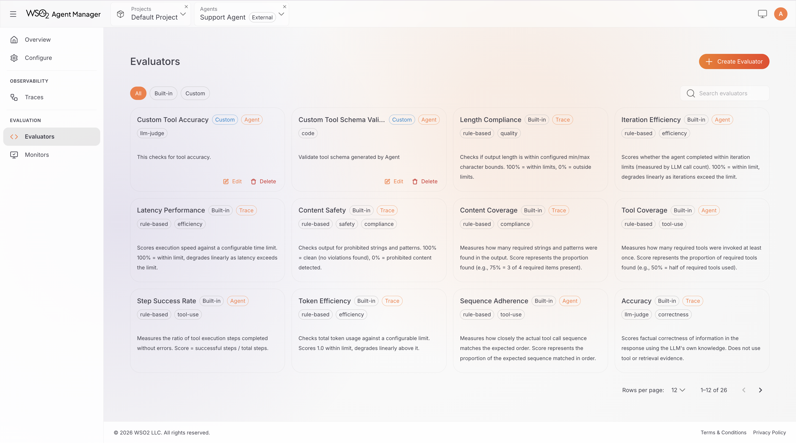
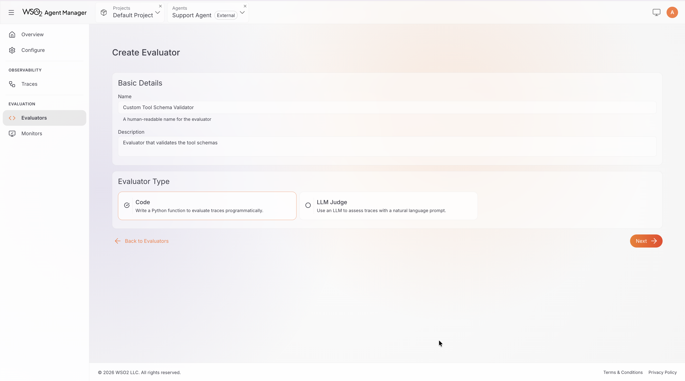
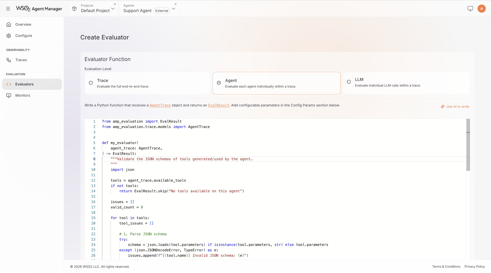
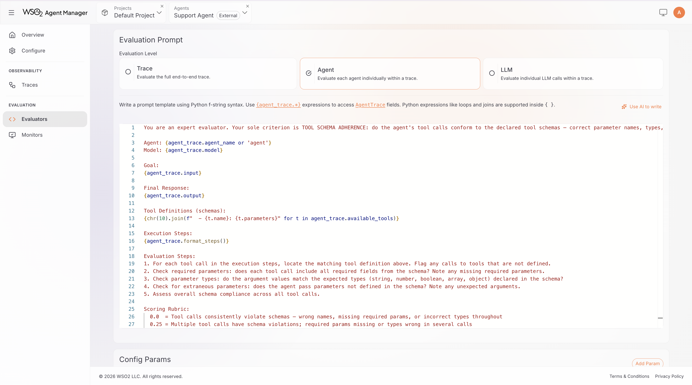

import Tabs from '@theme/Tabs';
import TabItem from '@theme/TabItem';

# Custom Evaluators

This tutorial walks you through creating custom evaluators in the AMP Console. Custom evaluators let you define domain-specific quality checks using Python code or LLM judge prompt templates.

## Prerequisites

- A running AMP instance (see [Quick Start](../getting-started/quick-start.mdx))
- An agent registered in AMP with an active environment
- Familiarity with [evaluation concepts](../concepts/evaluation.mdx), especially evaluator types and evaluation levels
- For LLM judge evaluators: an API key for a [supported LLM provider](../concepts/evaluation.mdx#supported-llm-providers)

---

## Navigate to Evaluators

1. Open the AMP Console and select your agent.
2. Click the **Evaluation** tab.
3. Click the **Evaluators** sub-tab to see the evaluators list.
4. Click **Create Evaluator**.



---

## Create a Custom Evaluator

### Step 1: Set Basic Details

1. Enter a **Display Name** (e.g., "Response Format Check" or "Domain Accuracy Judge").
2. The **Identifier** is auto-generated from the display name. You can customize it (must be lowercase with hyphens, 3–128 characters).
3. Add an optional **Description** explaining what this evaluator checks.
4. Select the **Evaluator Type**:
   - **Code**: write a Python function with arbitrary evaluation logic (deterministic rules, external API calls, regex matching, statistical analysis, or any combination)
   - **LLM-Judge**: write a prompt template that instructs an LLM to score trace quality — use this when evaluation requires subjective judgment (semantic accuracy, domain-specific quality, or nuanced reasoning assessment)



### Step 2: Select Evaluation Level

Select the level at which your evaluator operates:

- **Trace**: evaluates the full execution from input to output (`Trace` object)
- **Agent**: evaluates a single agent's steps and decisions (`AgentTrace` object)
- **LLM**: evaluates a single LLM call with messages and response (`LLMSpan` object)



### Step 3: Write the Evaluation Logic

<Tabs>
  <TabItem value="code" label="Code Evaluator" default>

The editor provides a **read-only header** with imports and the function signature (auto-generated from your selected level and config parameters). Write your logic in the **function body** below the header.

Your function must return an `EvalResult`:

- **Score**: `EvalResult(score=0.85, explanation="...")` — score between 0.0 (worst) and 1.0 (best)
- **Skip**: `EvalResult.skip("reason")` — use when the evaluator is not applicable to this input

**Example**: a trace-level evaluator that checks output contains valid JSON:

```python
def evaluate(trace: Trace) -> EvalResult:
    if not trace.output:
        return EvalResult.skip("No output to evaluate")

    import json
    try:
        json.loads(trace.output)
        return EvalResult(score=1.0, explanation="Output is valid JSON")
    except json.JSONDecodeError as e:
        return EvalResult(score=0.0, explanation=f"Invalid JSON: {e}")
```


:::tip
Use `EvalResult.skip()` instead of returning a score of 0.0 when the evaluator is not applicable. Skipped evaluations are tracked separately and do not affect aggregated scores.
:::

  </TabItem>
  <TabItem value="llm-judge" label="LLM-Judge Evaluator">

Use placeholders to inject trace data into your prompt. Available placeholders depend on the selected level:

- **Trace level**: `{trace.input}`, `{trace.output}`, `{trace.get_tool_steps()}`, etc.
- **Agent level**: `{agent_trace.input}`, `{agent_trace.output}`, `{agent_trace.get_tool_steps()}`, etc.
- **LLM level**: `{llm_span.input}`, `{llm_span.output}`, etc.

Write only the evaluation criteria — the system automatically wraps your prompt in scoring instructions that tell the LLM to return a structured score and explanation.

**Example**: a trace-level LLM judge for a travel booking agent:

```
You are evaluating a travel booking agent's response.

User query: {trace.input}

Agent response: {trace.output}

Tools used: {trace.get_tool_steps()}

Evaluate whether the agent:
1. Recommended flights that match the user's stated preferences (dates, budget, airline)
2. Provided accurate pricing information consistent with the tool results
3. Included all required booking details (confirmation number, departure time, gate info)

Score 1.0 if all criteria are met, 0.5 if partially met, 0.0 if the response is incorrect or misleading.
```



:::tip
LLM judge evaluators inherit the same **Model**, **Temperature**, and **Criteria** configuration as built-in LLM-as-Judge evaluators. These parameters are configurable when adding the evaluator to a monitor.
:::

  </TabItem>
</Tabs>

### Step 4: Use the AI Copilot (Optional)

The editor includes an **AI Copilot Prompt** section — a pre-built, context-aware prompt you can copy and paste into your AI assistant (e.g., ChatGPT, Claude). Describe what you want to evaluate, and the AI will generate the evaluation code or prompt template for you.

### Step 5: Define Configuration Parameters (Optional)

Configuration parameters make your evaluator reusable with different settings across monitors. For example, a content check evaluator might accept a `keywords` parameter so different monitors can check for different terms.

1. Expand the **Config Params** section.
2. Click **Add Parameter**.
3. For each parameter, configure:
   - **Key**: a Python identifier (e.g., `min_words`, `required_format`)
   - **Type**: string, integer, float, boolean, array, or enum
   - **Description**: shown to users when configuring the evaluator in a monitor
   - **Default value**: used when not overridden
   - **Constraints**: min/max for numbers, allowed values for enum types

In **Code** evaluators, parameters appear as keyword arguments in the function signature (e.g., `threshold: float = 0.5`). In **LLM-Judge** evaluators, parameters are available as `{key}` placeholders in your prompt template (e.g., `{domain}`).

### Step 6: Add Tags and Create

1. Optionally add **Tags** to categorize your evaluator (e.g., `format`, `domain-specific`, `compliance`).
2. Review your configuration.
3. Click **Create Evaluator**.

Your evaluator appears in the evaluators list and can be selected when creating or editing monitors.

---

## Use Custom Evaluators in a Monitor

Once created, custom evaluators appear in the evaluator selection grid alongside built-in evaluators when [creating or editing a monitor](./evaluation-monitors.mdx).

- Code evaluators are tagged with **code**
- LLM judge evaluators are tagged with **llm-judge**
- Your custom tags are also displayed on the evaluator cards

Select and configure custom evaluators the same way as built-in evaluators. Set parameter values, choose the LLM model (for LLM judges), and add them to the monitor.

---

## Edit and Delete Custom Evaluators

### Edit

Click an evaluator in the evaluators list to open it for editing. You can update:

- Display name and description
- Source code or prompt template
- Configuration parameter schema
- Tags

The **identifier** and **evaluation level** cannot be changed after creation.

### Delete

Click the **delete** icon on an evaluator in the list. Deletion is a soft delete. The evaluator is removed from the list, but existing monitor results referencing it are preserved.

:::info
A custom evaluator cannot be deleted while it is referenced by an active monitor. Remove the evaluator from all monitors before deleting it.
:::
